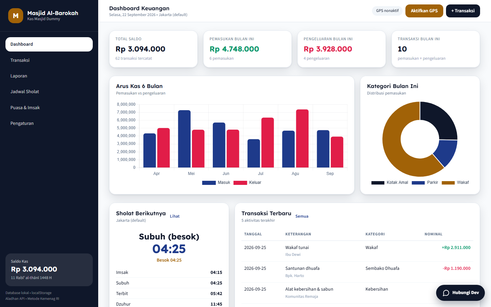
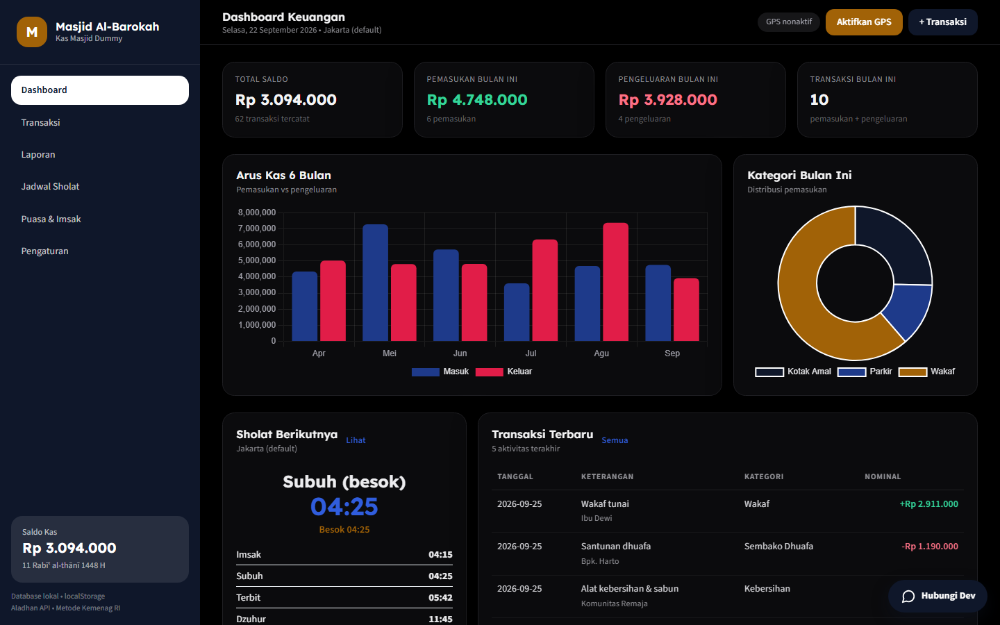
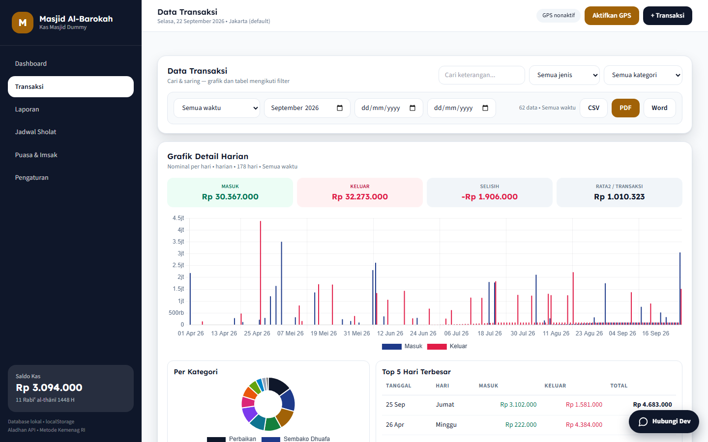
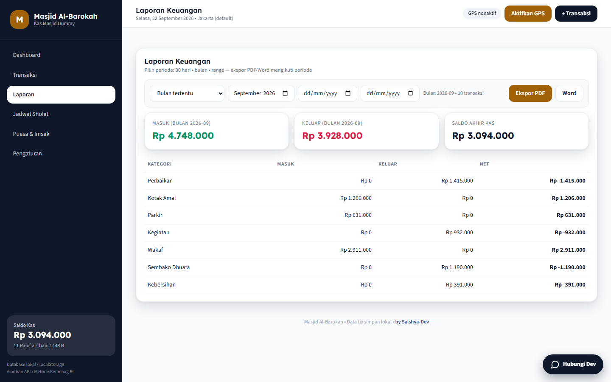
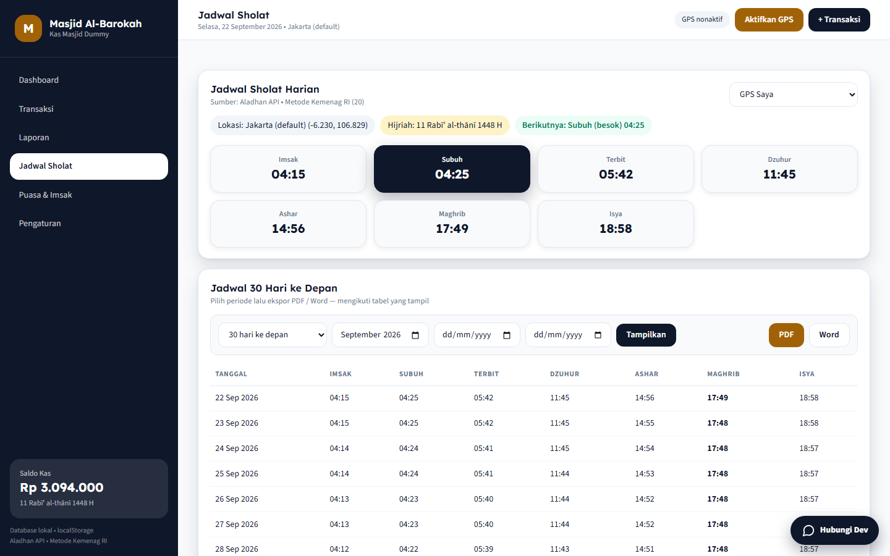
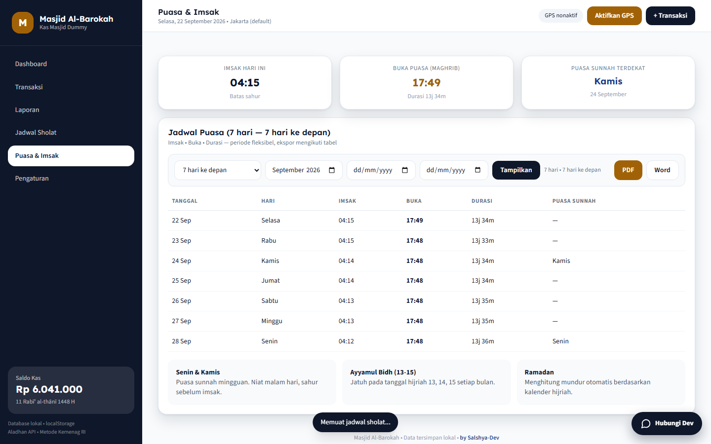
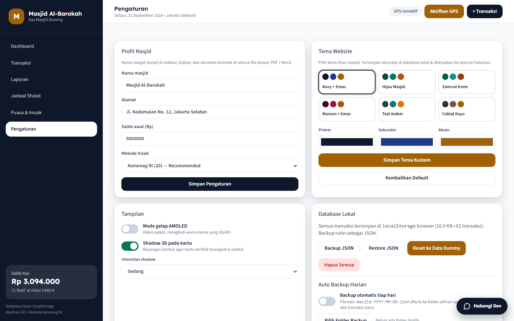

# KaJid — Dashboard Kas Masjid

Aplikasi web pencatatan keuangan masjid + jadwal sholat berbasis GPS + jadwal puasa & imsak, dengan ekspor PDF/Word dan database lokal. Tanpa build step — cukup buka di browser.

> **About:** Dashboard keuangan masjid (pemasukan/pengeluaran, bukti transaksi, laporan), jadwal sholat akurat lokasi GPS + alamat otomatis (Aladhan API, metode Kemenag RI), jadwal puasa & imsak, ekspor fleksibel (30 hari / bulan / range tanggal) ke PDF–Word–CSV, database lokal + auto-backup harian, tema khas masjid, mode gelap AMOLED, dan shadow 3D.

## Tampilan

| Dashboard terang | Dashboard gelap AMOLED |
|---|---|
|  |  |

| Transaksi + grafik harian | Laporan |
|---|---|
|  |  |

| Jadwal sholat | Puasa & imsak | Pengaturan |
|---|---|---|
|  |  |  |

## Fitur tiap halaman

- **Dashboard** — total saldo, pemasukan/pengeluaran & jumlah transaksi bulan ini, grafik arus kas 6 bulan, donat kategori pemasukan, kartu sholat berikutnya + countdown detik, 5 transaksi terbaru.
- **Transaksi** — tambah/ubah/hapus, cari keterangan, filter jenis/kategori/periode (semua waktu, 30 hari terakhir, bulan tertentu, range tanggal), **upload bukti struk (opsional, otomatis dikompres & tersimpan di database lokal)**, ringkasan masuk/keluar/selisih/rata-rata, **grafik detail harian** (animasi tumbuh bawah-ke-atas 1-per-1), donat per kategori, Top 5 hari terbesar, ekspor CSV/PDF/Word **mengikuti filter aktif**.
- **Laporan** — rekap masuk/keluar/net per kategori + saldo akhir kas per periode (bulan / 30 hari / range), ekspor PDF/Word.
- **Jadwal Sholat** — tombol Aktifkan GPS → koordinat + **alamat akurat otomatis** (reverse-geocode), fallback 15 kota, 7 waktu (Imsak, Subuh, Terbit, Dzuhur, Ashar, Maghrib, Isya), penanda sholat berikutnya, tanggal Hijriah, tabel periode fleksibel + ekspor PDF/Word.
- **Puasa & Imsak** — imsak & buka hari ini, durasi puasa, puasa sunnah terdekat (Senin/Kamis), tabel periode fleksibel (7/30 hari / bulan / range) + ekspor PDF/Word, info Senin–Kamis, Ayyamul Bidh, Ramadan.
- **Pengaturan** — profil masjid (nama tercetak di web & semua file ekspor), saldo awal, metode hisab, backup/restore JSON manual, **auto-backup harian ke folder pilihan + restore otomatis**, 6 tema khas masjid + warna kustom, **mode gelap AMOLED**, **shadow 3D** + intensitas, reset data dummy.

## Alur penggunaan

1. **Buka aplikasi** — data dummy langsung terisi (sekitar 60 transaksi 6 bulan) agar bisa dijelajahi.
2. **Atur profil** — Pengaturan → isi nama & alamat masjid, saldo awal, pilih metode hisab.
3. **Aktifkan lokasi** — klik Aktifkan GPS (atau pilih kota) agar jadwal sholat, imsak & buka puasa akurat.
4. **Catat keuangan** — tombol + Transaksi → isi tanggal, jenis, kategori, nominal, donatur (opsional) + foto bukti (opsional) → Simpan. Ubah/hapus lewat kolom Aksi.
5. **Pantau & laporkan** — lihat tren di Dashboard/Transaksi, buka Laporan per periode, ekspor PDF/Word/CSV untuk ditempel di papan pengumuman.
6. **Amankan data** — pilih folder lalu aktifkan Auto Backup Harian; backup manual JSON kapan saja; restore otomatis dari file terbaru.

## Cara menjalankan

```bash
cd "D:\koding\Projek Dummy\Kas Masjid Dummy"
python -m http.server 8080
# buka http://localhost:8080
```

Server lokal disarankan agar API jadwal (Aladhan, BigDataCloud) tidak terhambat. Data tersimpan di `localStorage` browser (`kasMasjidDB_v1`).

## Teknologi

HTML + Tailwind CDN + Chart.js + jsPDF + Aladhan API + BigDataCloud reverse-geocode + File System Access API. Tanpa server, tanpa build.

## Struktur

- `index.html` — layout SPA 6 halaman
- `docs/img/` — screenshot tampilan
- `assets/css/style.css` — token, tema, dark mode, animasi
- `assets/js/db.js` — database lokal + tema/preset
- `assets/js/dummy.js` — generator data dummy
- `assets/js/prayer.js` — GPS, alamat, jadwal sholat & puasa
- `assets/js/export.js` — ekspor PDF/Word/CSV
- `assets/js/autobackup.js` — auto-backup harian & restore folder
- `assets/js/app.js` — navigasi, grafik, CRUD, tema

---

by [Salshya-Dev](https://salshya-club.vercel.app/)
